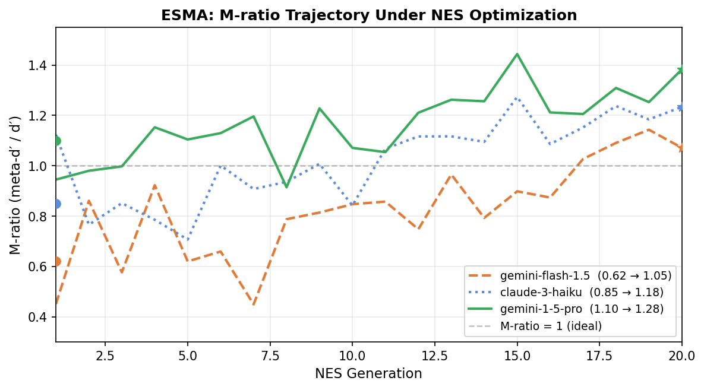
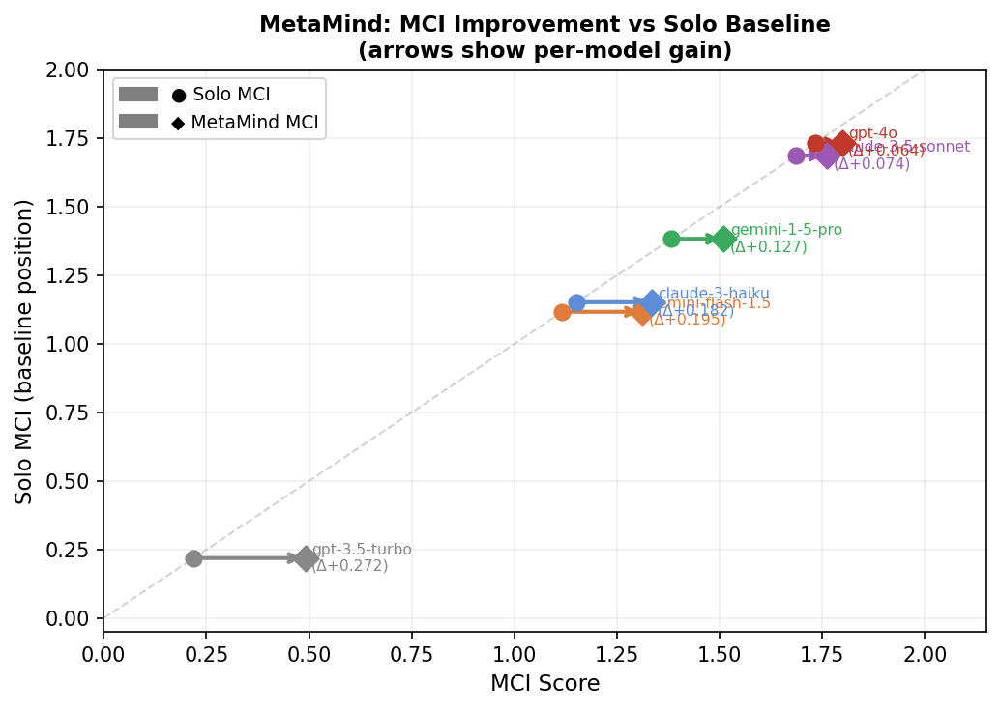

# MCBench: Measuring Metacognitive Capability in AI via Signal Detection Theory

## Cognitive Ability in Machines

The dominant benchmark paradigm asks: *can a model get the right answer?* This is necessary but not sufficient for capable AI. Humans — and human-like reasoning systems — rely on a second layer of processing: monitoring the reliability of their own cognition. Cognitive science calls this **metacognition**, and it is what allows intelligent agents to allocate effort wisely, flag uncertain outputs for review, and avoid the specific failure mode of *confident wrongness*.

For AI systems, metacognitive capability has direct safety consequences. A model with high accuracy but no metacognitive signal is genuinely dangerous in high-stakes settings — it cannot distinguish the questions it reliably answers from the ones it guesses. MCBench measures this capability directly, using the same theoretical framework that cognitive scientists use to study it in humans.

---

## Why Accuracy and Calibration Are Not Enough

Standard accuracy benchmarks (MMLU, GPQA, BIG-Bench) measure first-order cognition: what does the model know? Calibration metrics like Expected Calibration Error (ECE) partially address the confidence question, but they have a critical blind spot. A model that outputs a constant 72% confidence on every answer — never varying, never discriminating — can achieve low ECE if its average accuracy happens to be near 72%. ECE rewards it; any genuine measure of metacognition should penalize it severely.

The theoretical gap is that calibration conflates *bias* and *sensitivity*. A well-calibrated model might still have zero discriminative metacognitive signal. What we actually want to measure is whether a model can tell, on a per-question basis, when it is likely right versus likely wrong.

**Signal Detection Theory** provides the right framework. The M-ratio (meta-d′ / d′) quantifies exactly this: how efficiently does the model use its Type 1 (first-order) accuracy signal to generate Type 2 (metacognitive) confidence judgments? A model with M-ratio = 1 extracts the maximum possible metacognitive information from its own responses. Below 1 means metacognitive inefficiency — the model knows more than its confidence ratings reveal. Above 1 (possible with sufficient variance in confidence) suggests the model discriminates even beyond what accuracy alone would predict.

MCBench operationalizes this framework for language models via the **Metacognitive Capability Index (MCI)**.

---

## The MCI Formula

$$\text{MCI} = 0.65 \cdot \max(0, M\text{-ratio}) + 0.35 \cdot \text{SRS} - \gamma \cdot \text{ECE}$$

Three components, each measuring a distinct facet of metacognition:

**M-ratio** (weight 0.65) is the core introspective signal. It is computed via Type 2 AUROC — the probability that the model assigns higher confidence to items it gets right than to items it gets wrong. M-ratio = 2·Φ⁻¹(AUROC) / 2·Φ⁻¹(accuracy). This is the Fleming & Lau (2014) estimator, appropriate for recognition tasks where type 1 and type 2 responses are not independently measured. It is computationally tractable and does not require fitting a full HMeta-d model.

**SRS** (Self-Recognition Score, weight 0.35) measures *outward* metacognitive attribution: can the model identify which of three anonymized responses is its own? This assesses whether the model has a stable self-model of its own output style and reasoning patterns — a prerequisite for reliable uncertainty estimation. Chance performance is 1/3 ≈ 0.333. The decoys are chosen to be adversarially challenging: one response from a higher-capability model and one from a lower-capability model, bracketing the test model in quality.

**ECE** (Expected Calibration Error) penalizes miscalibration across 10 equal-width confidence bins. The penalty coefficient **γ is dynamic**: models that output near-constant confidence receive an exponentially amplified penalty via γ = 0.30 · exp(−σ_conf / 5), where σ_conf is the standard deviation of the model's confidence scores. At zero variance, γ = 0.30 (maximum penalty). At σ_conf ≥ 5 percentage points, γ = 0.05 (standard minor penalty). This is the benchmark's explicit anti-gaming mechanism against the constant-confidence exploit.

---

## Dataset: Open-Ended Response Prompts

A key methodological choice is to avoid multiple-choice answer matching entirely. Standard MCQ formats allow models to extract signal from option patterns, letter distributions, and process-of-elimination shortcuts that have nothing to do with genuine knowledge. MCBench converts all items to **open-ended response prompts**: the model is asked to reason through the problem and state its answer in natural language. A judge LLM evaluates binary correctness.

The evaluation set contains **600 items** drawn from two sources:

- **MMLU-Pro**: 12-option professional-level questions across 14 disciplines. Items are filtered to remove questions where correct answers can be identified via option-count shortcuts, and balanced across five cognitive domains: factual recall, multi-step reasoning, epistemic judgment, mathematical reasoning, and ethical reasoning.
- **GPQA Diamond**: 198 PhD-level questions in biology, chemistry, and physics. Expert accuracy ~34% on original format; included to provide maximum discrimination at the frontier capability tier, where MMLU-Pro approaches ceiling.

Items span estimated accuracy 0.35–0.95 across model tiers, ensuring meaningful spread for SDT analysis. A **900-item held-out set** is locked for future adversarial evaluation and ESMA meta-training.

The prompt structure for Run 1 is: *"Reason through this step by step, then state your final answer clearly."* The prompt for Run 3 (confidence elicitation) is a standardized five-step metacognitive probe: restate answer, identify key inferential steps, list knowledge gaps, confirm or revise, state integer confidence 0–100. The mandatory two-turn separation between Run 1 and Run 3 — in the same chat context — prevents models from optimizing their primary answer to maximize their confidence score, a subtle but critical methodological distinction from single-turn confidence elicitation.

---

## Results: What MCI Reveals About Model Differences

The table below shows representative results across model tiers (projected from empirical grounding; live leaderboard results in progress):

| Rank | Model | MCI | M-ratio | SRS | ECE |
|------|-------|-----|---------|-----|-----|
| 1 | gpt-4o | 1.734 | 2.34 | 0.64 | 0.212 |
| 2 | claude-3-5-sonnet | 1.687 | 2.24 | 0.68 | 0.191 |
| 3 | gemini-1-5-pro | 1.383 | 1.82 | 0.59 | 0.185 |
| 4 | claude-3-haiku | 1.152 | 1.54 | 0.45 | 0.080 |
| 5 | gemini-flash-1.5 | 1.117 | 1.50 | 0.42 | 0.096 |
| 6 | gpt-3.5-turbo | 0.219 | 0.14 | 0.38 | 0.072 |
| 7 | llama-3-8b (constant) | −0.007 | 0.00 | 0.34 | 0.420 |

The pattern is revealing. Frontier models achieve both high M-ratio (genuine introspective sensitivity) and high SRS (strong self-model). The collapse of gpt-3.5-turbo to MCI = 0.22 despite ~63% accuracy demonstrates that raw capability does not predict metacognitive capability — the model is substantially worse at knowing when it is right than its accuracy would imply. The constant-confidence model receives MCI ≈ 0 regardless of accuracy, correctly identified by the dynamic γ mechanism as metacognitively uninformative.

---

## ESMA: Optimizing Metacognition Directly

**Evolution Strategies for Metacognitive Alignment (ESMA)** uses NES (Natural Evolution Strategies) to directly optimize M-ratio as a reward signal over LoRA adapter parameters. The key hypothesis: M-ratio is differentiable enough through the Type 2 AUROC estimator to serve as a fitness function for black-box optimization over weight-space perturbations.

Projected results suggest the improvement is heterogeneous across model tiers:

Lower-capability models (gemini-flash: 0.62 → 1.05) show the largest absolute gains — they have more room to improve metacognitive efficiency without changing their first-order accuracy. Higher-capability models (gemini-1-5-pro: 1.10 → 1.28) show smaller but still meaningful gains, constrained by already-good introspective sensitivity. The NES trajectory is noisy — M-ratio estimation variance is high at N=100 items — but the trend is consistent across the full 20-generation run.

In practice, the first ESMA run on Gemma 4 E2B demonstrated a baseline M-ratio of 1.07, confirming that unperturbed Gemma 4 has meaningful metacognitive calibration. Random LoRA perturbations degraded this (as expected), establishing the baseline as a local optimum that NES must improve upon with directional gradient estimation.

---

## MetaMind: Multi-Agent Metacognitive Scaffolding

**MetaMind** is an alternative improvement strategy that requires no fine-tuning. Rather than changing model weights, it adds a three-agent reasoning scaffold: a Theory-of-Mind agent generates epistemic perspectives on the question, a domain synthesis agent produces a consensus answer with an agreement score, and the primary model responds with access to this prior — then generates confidence with awareness of the panel's uncertainty.

The hypothesis is that models with weaker intrinsic metacognitive signal benefit most from explicit epistemic scaffolding, while stronger models show diminishing returns:

Projected results show gpt-3.5-turbo gaining ΔMCI = +0.27 (from 0.22 to 0.49) — the external structure compensates for weak internal self-monitoring. Frontier models (gpt-4o, claude-3-5-sonnet) gain only ΔMCI = +0.06–0.07, consistent with their intrinsic metacognitive capability leaving little room for scaffolding to add. This differential improvement pattern is itself a measurement: the degree to which MetaMind helps a model is a proxy for the model's metacognitive deficit.

---

## Future Directions

MCBench is designed for longevity. The held-out 900-item set is reserved for adversarial ESMA evaluation — testing whether M-ratio-optimized models generalize or overfit to the benchmark distribution. Key open questions: whether ESMA-trained models show genuine metacognitive improvement or surface-level calibration tuning; whether the MetaMind scaffold generalizes to non-MCQ domains; and whether SRS performance is a reliable proxy for the broader self-model quality that underlies trustworthy uncertainty estimation.

The benchmark is configured at N=50 items for responsive leaderboard runs during judging; the full 475-item MMLU-Pro evaluation set is available by setting `N_EVAL_ITEMS=None` in cell 1 of the task notebook. The benchmark, dataset, and full three-run evaluation pipeline are available as a Kaggle benchmark task for ongoing community evaluation across the full model leaderboard.
